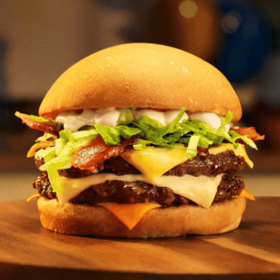

<h1 align="center">
    
    <p>Projeto Hamburgueria 👨‍💻</p>
</h1>

<h1><a href="https://restaurant-olive-seven.vercel.app/">Veja o site</a></h1>

## 📕 Sobre

**Projeto Restaurant** é um projeto de site de hamburgueria para prática de CSS Flexbox.

# ♻️ Como Contribuir 

```bash
    # Clone the project
    $ git clone https://github.com/BrunoVesp/restaurant.git
```

```bash
    #Enter directory
    $ cd restaurant
```

## 📃 Licença

This project is under the MIT License. See the file LICENSE for more details